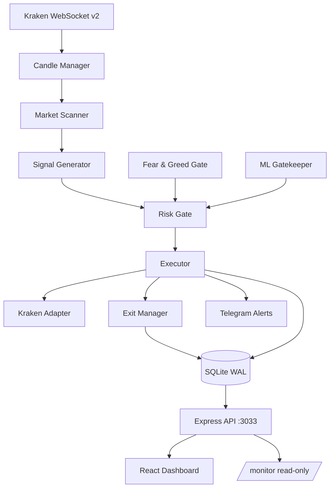

# CryptoGod

Automated multi-strategy cryptocurrency **daytrading** engine for Canadian Kraken accounts — USD pairs only, fee-aware 1h TREND/MOMENTUM plus ranging mean-reversion, paper by default, React monitoring dashboard.


## Overview

CryptoGod is a single Node process that streams Kraken market data over WebSocket, scans a
Canadian-legal USD ticker set on a 1h cadence, generates signals from TREND and MOMENTUM (STRONG_UP
only) plus a separate SIDEWAYS mean-reversion loop, filters them through a risk gate and an optional
ML gatekeeper, and flattens positions at the NY-session close. Every decision, rejection and fill is
written to a local SQLite database.

**The engine runs in paper mode by default.** `V2_MODE` defaults to `paper` (and `ecosystem.config.cjs`
sets the same). Orders are simulated against live Kraken prices; no real capital is committed. Live
execution is a configuration change, not a code change — which is exactly why the risk notice below
matters.

This is not a promise of profit. Kraken's realistic round-trip (maker in, taker out) is **0.42%**.
Anything that cannot clear that after slippage is a guaranteed loss, which is why the book refuses
sub-1% ATR, sits out non-STRONG_UP TREND regimes, and will not hold overnight.

The repository also contains a React dashboard (Vite) for backtesting, replay, risk and performance
inspection, and a separate self-contained read-only monitoring page served from `public/monitor.html`.

## Risk notice

> This software is built to place orders on a live cryptocurrency exchange. When live mode is
> enabled it will buy and sell real assets with real money, automatically, without a human in the
> loop. Trading cryptocurrency carries a substantial risk of loss, including total loss of capital.
>
> Nothing in this repository is financial advice. Past backtest or paper-trading results do not
> predict future returns — several of the figures quoted below exist precisely because a strategy
> that looked profitable stopped being profitable. The software is provided without warranty of any
> kind; see [`LICENSE`](LICENSE). You are solely responsible for anything it does with your money.

## Architecture



## How the engine works

The main loop lives in `v2/engine/tradeEngine.ts` and runs the same five stages on every pass.

1. **Scan** — `v2/pipeline/marketScanner.ts` walks `V2_CONFIG.SCAN_TICKERS`, reading the candle
   buffers that `v2/engine/candleManager.ts` maintains from the Kraken WebSocket feed. Tickers are
   rejected here for insufficient 24h volume, excessive spread, too few candles, ATR outside the
   `MIN_ATR_PERCENT` / `MAX_ATR_PERCENT` band, or a market regime outside `ALLOWED_REGIMES`
   (currently `STRONG_UP` and `UP`).
2. **Signal** — `v2/pipeline/signalGenerator.ts` scores the survivors and emits a candidate carrying
   a composite score, confidence, side and timeframe. Each strategy has its own signal module
   (`momentumSignal.ts`, `meanReversionSignal.ts`, `sniperSignal.ts`, `breakoutSignal.ts`).
3. **Risk gate** — `v2/pipeline/riskGate.ts` sizes the position and can veto it outright. Two
   external gates feed in: the Fear & Greed gate (`services/fearGreedGate.js`, seeded by the
   derivatives and whale-flow pollers) and the ML gatekeeper (`services/mlGatekeeper.js`), which is
   consulted only once a model has actually been trained.
4. **Execute** — `v2/pipeline/executor.ts` places the order through the exchange adapter
   (`v2/exchange/krakenAdapter.ts`). In paper mode the adapter simulates the fill against the live
   book; the rest of the pipeline is identical either way.
5. **Manage the exit** — `v2/pipeline/exitManager.ts` and the per-strategy variants own take profit,
   stop loss, break-even moves, the trailing stop, and the time-based kill. Closed trades are written
   to `v2_trades` in SQLite, which is what every later analysis reads.

### Strategy engines and their current state

| Engine | Where | State | Notes |
|---|---|---|---|
| **TREND** | `v2/engine/tradeEngine.ts` | **Enabled** — the main pipeline | 1h, long-only, `STRONG_UP` only, Canadian USD majors |
| **Momentum** | `v2/pipeline/momentumSignal.ts` | **Enabled** (`MOMENTUM_CONFIG.ENABLED = true`) | Same 1h book / risk gate / exit manager as TREND |
| **Mean reversion** | `v2/engine/meanReversionEngine.ts` | **Enabled** (`MR_CONFIG.ENABLED = true`) | Independent 1h loop, maker orders, `SIDEWAYS` only |
| **Sniper** | `v2/engine/sniperEngine.ts` | **Disabled** | Not daytrading |
| **Pairs** | `v2/pairs/pairsEngine.ts` | **Off** (`PAIRS_MODE=off`) | FIL/ICP swing; not same-session |
| **Bearish services** | `v2/engine/bearishServices.ts` | **Running**, TREND shorts off | `SHORTS_ENABLED = false` |
| **Breakout** | `v2/engine/breakoutEngine.ts` | **Disabled** | Not in `STRATEGY_TIMEFRAMES` |
| **Dual-exchange** | `v2/engine/dualExchangeEngine.ts` | **Off** by default (`DUAL_ENGINE` env) | A/B harness that runs identical signals on Kraken and Crypto.com to measure the fee differential |

## Evidence of engineering judgement

Strategies here are turned off by data, not by intuition. Every figure below is recorded in the
repository at the cited location, and each is labelled by where it came from.

**Breakout was disabled on backtest evidence.** *(backtest)*
A 180-day backtest produced **341 trades, a 28% win rate, and −$33 net**. The engine was disabled
rather than tuned, on the grounds that a 28% win rate is not a parameter problem.
Source: `v2/index.ts` — `// Breakout engine DISABLED — backtested 180 days: 341 trades, 28% WR, -$33 net`.

**Momentum was rebuilt rather than tuned, after a root-cause diagnosis.** *(backtest)*
The original momentum strategy scored **0% WR over 7 trades**. The diagnosis recorded in `v2/index.ts`
is specific: the entry math compared the MACD histogram — a price-*acceleration* quantity — against
absolute price changes. Different scales, so the comparison produced near-random output. The v2
rebuild (4h, z-score spike against a 20-bar stdev, higher-highs filter, RSI 50–70, percent-giveback
trail, 3× ATR take-profit, swing-low stop) backtests at **PF 1.70 / 90d, 1.85 / 60d, 1.92 / 30d** on
ZECUSD, RUNEUSD, FLOWUSD, ENAUSD, KASUSD, ICPUSD and WIFUSD.

**Shorts were disabled after an era split showed the edge had already died.** *(paper-trading record)*
Aggregated over all time, shorts entered in the `STRONG_DOWN` regime looked salvageable. Splitting the
same trades by period showed why that was an illusion:

| STRONG_DOWN shorts | Period | n | WR | Net PnL |
|---|---|---|---|---|
| Older | 2026-05-23 → 2026-06-04 | 17 | 82.4% | +$39.15 |
| Recent | 2026-06-11 → 2026-07-14 | 10 | 40.0% | −$20.80 |

The entire positive aggregate came from a roughly two-week window in late May and early June; every
`STRONG_DOWN` short since 2026-06-11 was net negative. `SHORTS_ENABLED` stayed `false`. The review
went further and identified that the recent losses were concentrated in trailing-stop exits giving
back open profit — so the note on record is that the *exit logic*, not the regime selection, is what
would have to be fixed before shorts are reconsidered at all.
Source: [`docs/reviews/2026-07-23-atr-floor-and-shorts-analysis.md`](docs/reviews/2026-07-23-atr-floor-and-shorts-analysis.md).

**A proposed change was rejected because the data located the cause elsewhere.** *(paper-trading record)*
The engine had taken zero entries for about two days, and the obvious suspect was the ATR floor, which
had recently been raised from 0.3% to 1.0%. A relaxation back to 0.8% had already been pre-registered
as the candidate fix. Counting actual rejection reasons in the live log window settled it: **396
rejections at the regime gate, 0 ATR-related rejections.** The floor was not rejecting anything. The
drought was a long-only strategy correctly standing aside in a bearish tape. The ATR floor was left
unchanged and the ticket closed as no-change.
Source: same review.

The same discipline shows up in the operating rules. Material configuration changes are accompanied by
a `stats_baseline_time` reset, so post-change reporting cannot be flattered by pre-change trades, and
[`CHANGELOG.md`](CHANGELOG.md) records what shipped, why, and what to monitor afterwards.

## Tech stack

| Layer | Choice |
|---|---|
| Runtime | Node 20+ with `--experimental-strip-types` — TypeScript is executed directly, with no build step for the server |
| Language | TypeScript 5.7, `strict: true` |
| Server | Express 4; `ws` for the Kraken WebSocket v2 feed |
| Persistence | SQLite via `better-sqlite3`, WAL mode, `data/trading.db` |
| ML | TensorFlow.js (`@tensorflow/tfjs`) for training, `onnxruntime-node` for inference |
| Frontend | React 18, React Router 7, Zustand, TanStack Query, Recharts, TailwindCSS |
| Build / test | Vite 6, Vitest 4, ESLint |
| Process management | PM2 (`ecosystem.config.cjs`, fork mode, process `canuck-node`) |
| Alerting | Telegram bot, plus `monitor.sh` health checks over email |

## Quickstart

**Prerequisites:** Node.js 20 or newer. Node 20 is required for `--experimental-strip-types`, which is
how the server runs `.ts` files directly.

```bash
git clone https://github.com/manijose1919/cryptoGod.git
cd cryptoGod
npm install

cp .env.example .env        # fill in exchange keys, Telegram, VPS_HOST as needed
npm run dev                 # backend on :3033 + Vite dev server on :3000
```

`npm run dev` starts both processes concurrently. The backend listens on port **3033**; the Vite dev
server listens on **3000** and proxies `/api` to the backend, so use `http://localhost:3000` in the
browser. The read-only monitoring page is served by the backend at `/monitor`.

Other commands:

```bash
npm start          # backend only
npm run build      # production frontend build into dist/
npm test           # vitest run
npm run typecheck  # tsc --noEmit
npm run lint       # eslint
```

The engine defaults to `paper` mode when `V2_MODE` is unset. Nothing places a real order until that
value is deliberately changed to `live`.

## Project layout

```
serverV2.ts            Live entry point — boots database, gates, WebSocket, ML, and the V2 engine
ecosystem.config.cjs   PM2 process definition (canuck-node, fork mode, port 3033, paper mode)

v2/                    The trading engine
  engine/              Trade loop, candle manager, position manager, per-strategy engines, config.ts
  pipeline/            Scanner, signal generators, risk gate, executor, exit managers, time gate
  exchange/            Kraken and Crypto.com adapters behind a common interface
  indicators/          TC indicator, support/resistance, trend dashboard, shared indicator math
  attribution/         Post-trade analysis, signal scorecards, attribution store
  backtest/            Backtest engine, candle cache, canonical and multi-strategy sweeps
  pairs/               Cointegration model, pairs engine, executor, monitor and alerts
  dashboard/           Express router for the V2 API and the /monitor summary endpoint

services/              Backend services (.js) and frontend services (.ts) — market data, ML,
                       sentiment, database, exchange adapters, risk and reporting
routes/                Express route modules mounted by the server (market, persistence, signals, ...)
components/            React dashboard components
containers/            Page and panel layout shells
contexts/ hooks/ stores/   React state: contexts, custom hooks, Zustand stores
core/                  Cross-cutting engine helpers (event bus, logging, portfolio, Telegram)
types/                 Shared types, including services.d.ts for the plain-JS backend modules
public/                monitor.html — the standalone read-only monitoring page
tests/                 Vitest suites
scripts/               Backtests, ML training pipelines, deploy and health scripts
docs/                  Design specs, implementation plans, reviews and runbooks
```

## Documentation

- [`docs/README.md`](docs/README.md) — index of every design spec, plan, review and runbook
- [`docs/ARCHITECTURE.md`](docs/ARCHITECTURE.md) — process model, boot sequence, module tour, deployment
- [`CHANGELOG.md`](CHANGELOG.md) — what shipped, why, and what to monitor
- [`CLAUDE.md`](CLAUDE.md) — engineering and operational rules for this repository

## License

Proprietary — all rights reserved. See [`LICENSE`](LICENSE). The source is published for viewing and
evaluation only; no permission is granted to use, copy, modify or distribute it.
