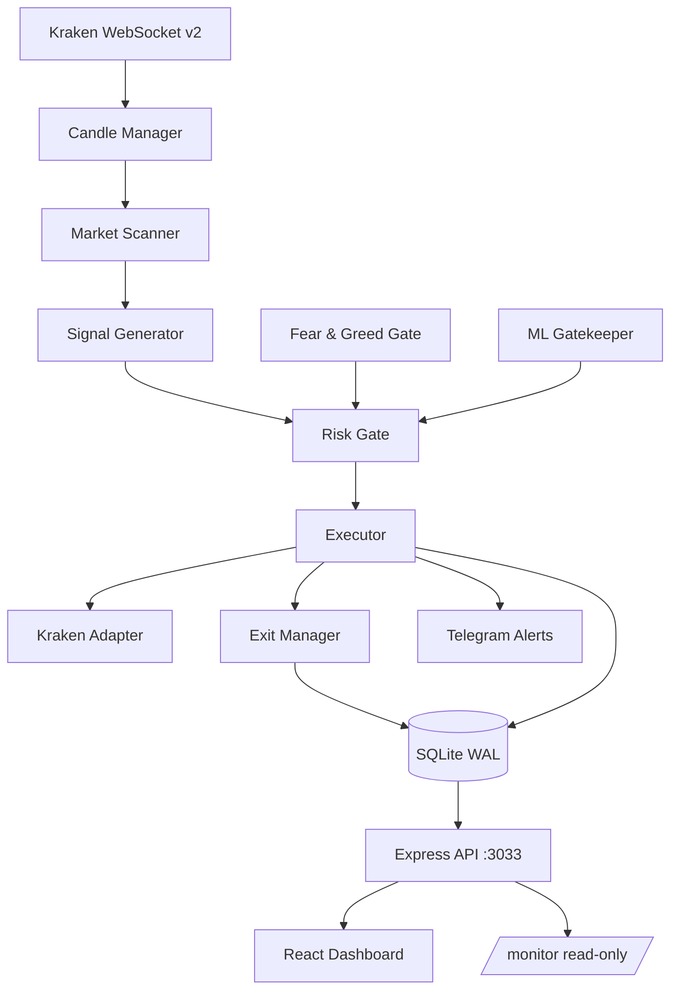

# Repository Documentation and Cleanup — Implementation Plan

> **For agentic workers:** REQUIRED SUB-SKILL: Use superpowers:subagent-driven-development (recommended) or superpowers:executing-plans to implement this plan task-by-task. Steps use checkbox (`- [ ]`) syntax for tracking.

**Goal:** Make the `cryptoGod` repository publishable and readable — accurate documentation, a green CI, no dead stacks, and no VPS address in the working tree or history.

**Architecture:** Sequential commits, each independently revertable. Reversible work lands and deploys first; the irreversible history rewrite runs last, behind a full backup bundle. Type errors are fixed before documentation so the README's CI badge is honest the moment it ships.

**Tech Stack:** TypeScript 5.7 (strict), Node 20 with `--experimental-strip-types`, Vite 6, Vitest 4, Express 4, SQLite via better-sqlite3, PM2, GitHub Actions.

**Spec:** `docs/superpowers/specs/2026-07-28-repo-documentation-and-cleanup-design.md`

---

## Global Constraints

- **No trading behaviour changes.** No strategy, threshold, gate, sizing rule, or config value in `v2/engine/config.ts` may be altered. Consequently **no stats baseline reset** (standing rule, `CLAUDE.md`).
- **Match existing style.** Single quotes, 2-space indent, ES modules, `.ts` extensions in v2 imports (`from './engine/config.ts'` — this is deliberate, `allowImportingTsExtensions` is on).
- **Surgical diffs.** No reformatting, no import reordering, no drive-by renames.
- **Push to BOTH remotes** via `bash scripts/push-deploy.sh` — never `git push origin` alone.
- **Commit messages** end with the `Co-Authored-By: Claude Opus 5` and `Claude-Session` trailers used throughout this repo's history.
- **Never delete untracked files.** Local clutter gets gitignored, not removed.

## Verified Baseline (measured 2026-07-28, before any change)

| Gate | Command | Result |
|---|---|---|
| Type check | `npx tsc --noEmit` | **FAIL — exit 2, 157 errors** |
| Tests | `npx vitest run` | PASS — 18/18 in 2 files |
| Build | `npx vite build` | PASS — exit 0, built in 12.36s |
| CI | `gh run list` | **FAIL — last 5 runs all `failure`** |

The type check and CI are failing **before** this work begins. Any task that leaves them failing has not regressed anything, but Task 8 is the gate that must turn them green.

**On the expected error counts in Tasks 3–7:** each task states the count it should leave behind (157 → 153 → 109 → 103 → 83 → 0). These are derived from the inventory below, and fixing one error can reveal or resolve another. A count that is off by a few is not a failure — read the remaining errors and continue. A count that moves in the wrong direction, or barely moves at all, means the fix missed; investigate before committing.

### Error inventory (157 total)

| Count | Code | Meaning | Task |
|---|---|---|---|
| 69 | TS6133 | Declared but never read | 7 |
| 48 | TS7016 | Untyped `.js` import → implicit `any` | 3, 4 |
| 12 | TS18048 | Possibly `undefined` | 6 |
| 10 | TS7006 | Implicit `any` parameter | 7 |
| 6 | TS2740 | `Record<TradingStrategy, T>` missing 5 keys | 5 |
| 4 | TS2345 | Argument type not assignable | 6 |
| 3 | TS6196 | Type declared but never used | 7 |
| 2 | TS2339 | Property does not exist on type | 6 |
| 1 | TS6192 | All imports unused | 7 |
| 1 | TS2322 | Type not assignable | 6 |
| 1 | TS18047 | Possibly `null` | 6 |

---

## File Structure

**Created:**

| File | Responsibility |
|---|---|
| `README.md` (replaces existing) | Hero document — what, why, architecture, quickstart |
| `LICENSE` | Proprietary / All Rights Reserved |
| `docs/ARCHITECTURE.md` | Accurate system design and data flow |
| `docs/README.md` | Index for the 13 existing plan/spec/review/runbook docs |
| `types/services.d.ts` | Ambient declarations for 13 untyped `services/*.js` modules |

**Modified:** `package.json`, `CLAUDE.md`, `.gitignore`, `CHANGELOG.md`, `docker-compose.yml`, `prometheus/prometheus.yml`, `deploy/*`, plus the source files listed per task.

**Deleted:** `server.js`, `canuck-trader-pro/`, `next _step_evolution.txt`, `canuck-trader-pro/data/trading.db-{shm,wal}`.

---

## Task 1: Junk removal and gitignore

**Files:**
- Delete (tracked): `next _step_evolution.txt`, `canuck-trader-pro/data/trading.db-shm`, `canuck-trader-pro/data/trading.db-wal`
- Modify: `.gitignore`

**Interfaces:**
- Consumes: nothing
- Produces: a clean `git status`; later tasks assume no stray tracked artifacts

- [ ] **Step 1: Confirm the three files are tracked**

```bash
git ls-files | grep -E 'next _step_evolution|trading\.db-(shm|wal)'
```
Expected: exactly 3 lines.

- [ ] **Step 2: Untrack them (keep the local copies)**

```bash
git rm --cached "next _step_evolution.txt" \
  canuck-trader-pro/data/trading.db-shm \
  canuck-trader-pro/data/trading.db-wal
```

- [ ] **Step 3: Append ignore rules to `.gitignore`**

Add at the end of the file:

```gitignore

# SQLite write-ahead artifacts
*.db-shm
*.db-wal

# Archives and logs
*.tar
*.tar.gz
*.log

# Local scratch notes
/code.txt
/moresteps.txt
/nextstep.txt
/Command.txt
/FireHorseProtocol.txt
/gemini-spec-formatted.txt
/next _step_evolution.txt
/nul
/txt/
```

- [ ] **Step 4: Verify status is clean of these entries**

```bash
git status --porcelain | grep -E 'trading\.db-|\.tar|\.log|next _step'
```
Expected: only the staged deletions (`D` lines), no untracked (`??`) lines for those patterns.

- [ ] **Step 5: Commit**

```bash
git add .gitignore
git commit -m "chore: untrack build artifacts and ignore local scratch files

Untracks SQLite WAL/SHM temp files and a scratch note that were committed
by accident. Extends .gitignore to cover archives, logs, and root scratch
notes so they stop appearing in git status.

Co-Authored-By: Claude Opus 5 <noreply@anthropic.com>
Claude-Session: https://claude.ai/code/session_01B5r4UPkQVsGY2DPB5ak1LX"
```

---

## Task 2: Retire dead stacks

`server.js` (418KB) is imported by nothing — every reference to the string `server.js` elsewhere is inside a comment. `canuck-trader-pro/` is a parallel Python backend that PM2 does not run and no Node module imports.

**Files:**
- Delete: `server.js`, `server-indicator-service.js`, `canuck-trader-pro/` (entire directory)
- Modify: `package.json`, `docker-compose.yml`, `prometheus/prometheus.yml`, `deploy/deploy.ps1`, `deploy/setup-vps.sh`, `deploy/trading-bot.service`

**Interfaces:**
- Consumes: clean tree from Task 1
- Produces: a repo whose only server entry point is `serverV2.ts`

- [ ] **Step 1: Re-verify nothing imports the deletion targets**

```bash
git grep -nE "(import|require)[^\n]*['\"][^'\"]*(server\.js|server-indicator-service\.js)" -- '*.ts' '*.tsx' '*.js'
git grep -ln "canuck-trader-pro" -- ':!canuck-trader-pro' ':!.gitignore'
```
Expected: first command returns nothing. Second returns only `package.json`, `docker-compose.yml`, `prometheus/prometheus.yml`, and `deploy/*` — config references, not code imports.

**STOP if the first command returns anything.** That means something does import it; report and do not delete.

- [ ] **Step 2: Delete the dead stacks**

```bash
git rm -r --quiet server.js server-indicator-service.js canuck-trader-pro
```

- [ ] **Step 3: Remove the Python service block from `docker-compose.yml`**

Open the file and delete the service definition whose `build` or `command` points at `canuck-trader-pro`, along with any `depends_on` entry naming it. Leave every other service intact.

- [ ] **Step 4: Remove the Python scrape target from `prometheus/prometheus.yml`**

Delete the `scrape_configs` job whose target is the `canuck-trader-pro` backend port. Leave the Node target intact.

- [ ] **Step 5: Remove Python references from `deploy/`**

In `deploy/deploy.ps1`, `deploy/setup-vps.sh`, and `deploy/trading-bot.service`, delete lines that install Python requirements or launch `main.py`. These scripts already point at PM2 for the Node process; only the Python half is removed.

- [ ] **Step 6: Run all three gates**

```bash
npx vitest run
npx vite build
npx tsc --noEmit 2>&1 | grep -c 'error TS'
```
Expected: vitest 18/18 PASS. vite build exit 0. Type error count still **157** — deleting a `.js` file and a Python tree cannot change the TypeScript error count, so any change here means something unexpected happened. Investigate before proceeding.

- [ ] **Step 7: Commit**

```bash
git add -A
git commit -m "chore: retire legacy server.js and Python backend

server.js (418KB) is imported by nothing — every reference to it in the
codebase is a comment. canuck-trader-pro/ is a parallel Python backend that
PM2 does not run and no Node module imports; it was referenced only by
config files, which are updated here.

The live entry point is serverV2.ts (see ecosystem.config.cjs). services/
is untouched — serverV2.ts imports it directly and it remains live.

Both stacks remain recoverable from git history.

Co-Authored-By: Claude Opus 5 <noreply@anthropic.com>
Claude-Session: https://claude.ai/code/session_01B5r4UPkQVsGY2DPB5ak1LX"
```

---

## Task 3: Install missing type packages

Four errors in `serverV2.ts` are simply `express` and `cors` having no bundled types.

**Files:**
- Modify: `package.json`, `package-lock.json`

**Interfaces:**
- Consumes: nothing
- Produces: typed `express` and `cors`, removing 4 errors

- [ ] **Step 1: Confirm the errors exist**

```bash
npx tsc --noEmit 2>&1 | grep -E "@types/(express|cors)"
```
Expected: lines suggesting `npm i --save-dev @types/express` and `@types/cors`.

- [ ] **Step 2: Install as dev dependencies**

```bash
npm install --save-dev @types/express@^4 @types/cors
```

`@types/express@^4` is pinned to major 4 deliberately — the runtime dependency is `express@^4.19.2`, and `@types/express@5` describes a different API surface.

- [ ] **Step 3: Verify error count dropped**

```bash
npx tsc --noEmit 2>&1 | grep -c 'error TS'
```
Expected: **153** (down from 157).

- [ ] **Step 4: Confirm no runtime impact**

```bash
npx vitest run && npx vite build
```
Expected: 18/18 PASS, build exit 0. These are types-only packages and cannot affect runtime.

- [ ] **Step 5: Commit**

```bash
git add package.json package-lock.json
git commit -m "build: add @types/express and @types/cors

serverV2.ts imports express and cors, neither of which ships types. Adds the
DefinitelyTyped packages as devDependencies. @types/express pinned to major 4
to match the express@^4.19.2 runtime dependency.

Types-only change: no runtime behaviour affected. 157 -> 153 type errors.

Co-Authored-By: Claude Opus 5 <noreply@anthropic.com>
Claude-Session: https://claude.ai/code/session_01B5r4UPkQVsGY2DPB5ak1LX"
```

---

## Task 4: Declare types for untyped service modules

44 remaining `TS7016` errors come from 13 plain-JavaScript modules in `services/` imported by typed code. Fix them at the boundary with one ambient declaration file rather than converting 13 files to TypeScript.

**Files:**
- Create: `types/services.d.ts`
- Modify: `tsconfig.json` (add `types/**/*.d.ts` to `include`)

**Interfaces:**
- Consumes: nothing
- Produces: typed import boundary for `services/*.js`; every later task benefits

The 13 modules, each imported under two different relative paths (`./services/x.js` from root, `../../services/x.js` from `v2/`):

`database.js`, `fearGreedGate.js`, `krakenWebsocketService.js`, `telegramService.js`, `mlGatekeeper.js`, `mlPredictionService.js`, `systemConfig.js`, `derivativesIntelligence.js`, `whaleFlowTracker.js`, `websocketService.js`, `newCoinDetector.js`, `exchangeAdapters/krakenAdapter.js`, `exchangeAdapters/cryptocomAdapter.js`

- [ ] **Step 1: Record the exact error list to work against**

```bash
npx tsc --noEmit 2>&1 | grep TS7016 > /tmp/ts7016.txt
wc -l /tmp/ts7016.txt
```
Expected: 44 lines.

- [ ] **Step 2: Read each module's real exports**

For each of the 13 modules, list what it actually exports — do not guess signatures:

```bash
for f in database fearGreedGate krakenWebsocketService telegramService mlGatekeeper \
         mlPredictionService systemConfig derivativesIntelligence whaleFlowTracker \
         websocketService newCoinDetector; do
  echo "=== $f ==="
  grep -nE '^export (async )?function|^export const|^export \{|^export default' "services/$f.js"
done
grep -nE '^export' services/exchangeAdapters/krakenAdapter.js services/exchangeAdapters/cryptocomAdapter.js
```

- [ ] **Step 3: Write `types/services.d.ts`**

Declare each module under **both** specifier forms, because TypeScript resolves `./services/x.js` and `../../services/x.js` as distinct module specifiers. Use the signatures observed in Step 2 — the block below shows the required shape and the two known-correct entries; fill the remaining modules the same way from real exports.

```typescript
// Ambient declarations for the plain-JavaScript modules in services/.
// These modules are live (serverV2.ts imports them directly) but are not
// written in TypeScript. Declaring them here types the import boundary
// without rewriting 13 files.
//
// Each module is declared twice: once for the root-relative specifier used by
// serverV2.ts, once for the v2/-relative specifier used inside v2/.

declare module './services/database.js' {
  export function initializeDatabase(): void;
  // ...remaining exports observed in Step 2
}
declare module '../../services/database.js' {
  export * from './services/database.js';
}

declare module './services/telegramService.js' {
  export function initTelegram(): void;
  export function isEnabled(): boolean;
  export function alertCircuitBreaker(message: string): void;
  // ...remaining exports observed in Step 2
}
declare module '../../services/telegramService.js' {
  export * from './services/telegramService.js';
}

// Repeat for: fearGreedGate, krakenWebsocketService, mlGatekeeper,
// mlPredictionService, systemConfig, derivativesIntelligence,
// whaleFlowTracker, websocketService, newCoinDetector,
// exchangeAdapters/krakenAdapter, exchangeAdapters/cryptocomAdapter
```

Where a signature is genuinely dynamic, type it honestly (`unknown`, or a named interface) rather than `any` — the point of this task is to remove implicit `any`, not to relabel it.

- [ ] **Step 4: Add the declarations to `tsconfig.json` `include`**

Append `"types/**/*.d.ts"` to the existing `include` array. Do not modify any other tsconfig field — in particular leave `strict`, `noUnusedLocals`, and `noUnusedParameters` set to `true`.

- [ ] **Step 5: Verify TS7016 is eliminated**

```bash
npx tsc --noEmit 2>&1 | grep -c 'TS7016'
npx tsc --noEmit 2>&1 | grep -c 'error TS'
```
Expected: TS7016 count **0**; total **109**.

- [ ] **Step 6: Verify runtime is unaffected**

```bash
npx vitest run && npx vite build
```
Expected: 18/18 PASS, build exit 0. A `.d.ts` file emits nothing.

- [ ] **Step 7: Commit**

```bash
git add types/services.d.ts tsconfig.json
git commit -m "types: declare ambient types for untyped services/*.js modules

13 plain-JavaScript modules in services/ are imported by typed code, producing
44 TS7016 implicit-any errors. Declares them in types/services.d.ts using their
real exported signatures, under both the root-relative and v2-relative
specifier forms TypeScript treats as distinct.

Declaration-only: emits nothing, no runtime change. 153 -> 109 type errors.

Co-Authored-By: Claude Opus 5 <noreply@anthropic.com>
Claude-Session: https://claude.ai/code/session_01B5r4UPkQVsGY2DPB5ak1LX"
```

---

## Task 5: Resolve the `Record<TradingStrategy, T>` gap

Six `TS2740` errors share one root cause. `TradingStrategy` has 12 members, but several lookup tables define only the original 7 (`TREND`, `BREAKOUT`, `WHALE`, `CONFLUENCE`, `MOMENTUM`, `DIVERGENCE`, `ADAPTIVE`). `CLAUDE.md` documents this deliberately: *"Many backend/service functions only accept the original 7 strategies... fall back to ADAPTIVE."*

The type currently lies by claiming all 12 keys are present. The fix is to make the type tell the truth.

**Files:**
- Modify: `types.ts` (add `CoreTradingStrategy`)
- Modify: `services/aiLearningService.ts:129`, `:156`, `:808`
- Modify: `services/assetIntelligenceService.ts:221`
- Modify: `components/TradingControls.tsx:72`, `:82`

**Interfaces:**
- Consumes: nothing
- Produces: `CoreTradingStrategy` exported from `types.ts`, used by Tasks 6 if needed

- [ ] **Step 1: Confirm the six error sites**

```bash
npx tsc --noEmit 2>&1 | grep TS2740
```
Expected: 6 lines at the file/line positions above.

- [ ] **Step 2: Read how `TradingStrategy` is declared**

```bash
grep -n "TradingStrategy" types.ts | head -20
```

- [ ] **Step 3: Add the narrowed type to `types.ts`**

Immediately after the existing `TradingStrategy` declaration, add:

```typescript
/**
 * The seven strategies that predate the V2 expansion. Several lookup tables
 * (adaptive weights, per-strategy stats, asset-affinity profiles) only ever
 * carry entries for these. Typing those tables as Record<TradingStrategy, T>
 * claimed twelve keys existed when only seven did.
 */
export type CoreTradingStrategy =
  | 'TREND'
  | 'BREAKOUT'
  | 'WHALE'
  | 'CONFLUENCE'
  | 'MOMENTUM'
  | 'DIVERGENCE'
  | 'ADAPTIVE';
```

- [ ] **Step 4: Retype the six sites**

At each of the six positions, change the annotation from `Record<TradingStrategy, T>` to `Record<CoreTradingStrategy, T>`, keeping `T` exactly as it is. Add the `CoreTradingStrategy` import where the file does not already import from `types.ts`.

Do **not** add the five missing strategies to the object literals. That would invent weights, stats, and affinity profiles that were never measured — fabricated trading parameters are far worse than a narrowed type.

- [ ] **Step 5: Verify TS2740 is gone and nothing new appeared**

```bash
npx tsc --noEmit 2>&1 | grep -c 'TS2740'
npx tsc --noEmit 2>&1 | grep -c 'error TS'
```
Expected: TS2740 **0**; total **103**.

If new errors appear at call sites that index these tables with a full `TradingStrategy`, that is the type surfacing a real latent gap — a lookup that can return `undefined` at runtime. Fix it by narrowing the caller or handling the miss, and note it in the commit message.

- [ ] **Step 6: Run tests and build**

```bash
npx vitest run && npx vite build
```
Expected: 18/18 PASS, build exit 0.

- [ ] **Step 7: Commit**

```bash
git add types.ts services/aiLearningService.ts services/assetIntelligenceService.ts components/TradingControls.tsx
git commit -m "types: introduce CoreTradingStrategy for the pre-V2 seven

Six TS2740 errors came from lookup tables typed Record<TradingStrategy, T>
while defining only the original seven strategies. CLAUDE.md documents this
as intentional, so the type was wrong, not the data.

Adds CoreTradingStrategy and retypes the adaptive-weight, per-strategy-stats,
and asset-affinity tables to it. Deliberately does NOT backfill the five
missing strategies — inventing untested weights and affinity profiles would
be worse than a narrower type.

No trading behaviour change. 109 -> 103 type errors.

Co-Authored-By: Claude Opus 5 <noreply@anthropic.com>
Claude-Session: https://claude.ai/code/session_01B5r4UPkQVsGY2DPB5ak1LX"
```

---

## Task 6: Fix substantive type errors

The remaining non-cosmetic errors. Several are latent runtime crashes, so each gets investigated rather than silenced with a non-null assertion.

**Files:**
- Modify: `components/ExchangeDashboard.tsx` (10× TS18048), `components/GridTraining.tsx:47` (TS18047), `components/MLTrainingPanel.tsx:228,240,245,247` (4× TS2345), `components/SocialSentimentPanel.tsx:109,110` (2× TS2339), `services/assetIntelligenceService.ts:565` (TS2322), `v2/pipeline/momentumExitManager.ts:129,130` (2× TS18048)
- Modify: `types.ts` if `Headline` genuinely needs a `url` field

**Interfaces:**
- Consumes: `CoreTradingStrategy` from Task 5
- Produces: nothing consumed downstream

- [ ] **Step 1: `ExchangeDashboard.tsx` — guard `status`**

`status` is possibly `undefined` at lines 266, 271, 273, 284, 285 (×2), 296 (×2), 310 (×2). Read the component to find where `status` originates. Add a single early return or guard covering the whole block rather than ten separate `?.` operators:

```typescript
if (!status) return null;  // or the component's existing empty-state element
```

Match whatever empty state the surrounding components already use — check a sibling panel first.

- [ ] **Step 2: `momentumExitManager.ts:129-130` — handle undefined `peakPrice`**

This is exit logic on a live engine, so read the surrounding function before changing anything:

```bash
sed -n '110,140p' v2/pipeline/momentumExitManager.ts
grep -n "peakPrice" v2/pipeline/momentumExitManager.ts v2/pipeline/types.ts
```

Determine whether `peakPrice` is genuinely optional at this point. If it is initialised on entry and only absent for legacy open trades, fall back to the entry price and comment why. If it can legitimately be absent, skip the trailing-exit check for that trade rather than comparing against a wrong number.

**Do not use `!`.** A non-null assertion here converts a type error into a production `NaN` comparison in exit logic.

- [ ] **Step 3: `MLTrainingPanel.tsx` — correct the log-level casing**

Lines 228, 240, 245, 247 pass `'info'`, `'error'`, `'success'`, `'error'` where the parameter type is `'BUY' | 'SELL' | 'INFO' | 'WARN' | 'ERROR' | 'SPECIAL' | undefined`. Map them to the valid members:

- `'info'` → `'INFO'`
- `'error'` → `'ERROR'`
- `'success'` → `'INFO'` (there is no `SUCCESS` member; confirm against the union in `types.ts` before choosing)

This is a real bug: these log entries have been emitting values the consumer does not recognise.

- [ ] **Step 4: `SocialSentimentPanel.tsx:109-110` — reconcile `Headline.url`**

```bash
grep -n "interface Headline" -A 12 types.ts
grep -rn "Headline" services/ --include=*.ts | head
```

If the service that produces `Headline` objects really does populate `url`, add `url?: string` to the interface and guard the two usages. If it does not, the component is reading a field that is always `undefined` — remove the link rendering. Decide from the producer, not the consumer.

- [ ] **Step 5: `GridTraining.tsx:47` — guard null `results`**

Add a null check before the dereference, matching the component's existing loading/empty pattern.

- [ ] **Step 6: `assetIntelligenceService.ts:565` — narrow the string**

A plain `string` is assigned where `'NEUTRAL' | 'BULLISH' | 'BEARISH' | 'VERY_BULLISH' | 'VERY_BEARISH'` is required. Find where the value is produced and type it at the source (a `const` assertion or an explicitly typed return) rather than casting at the assignment.

- [ ] **Step 7: Verify all substantive codes are gone**

```bash
npx tsc --noEmit 2>&1 | grep -cE 'TS18048|TS18047|TS2345|TS2339|TS2322'
npx tsc --noEmit 2>&1 | grep -c 'error TS'
```
Expected: first **0**; total **83**.

- [ ] **Step 8: Run tests and build**

```bash
npx vitest run && npx vite build
```
Expected: 18/18 PASS, build exit 0.

- [ ] **Step 9: Commit**

```bash
git add -A
git commit -m "fix: resolve substantive type errors, including two latent bugs

- ExchangeDashboard: guard possibly-undefined status (10 sites)
- momentumExitManager: handle undefined peakPrice in the trailing-exit check
  rather than asserting non-null, which would have compared against NaN
- MLTrainingPanel: log levels were lowercase ('info'/'error'/'success') where
  the consumer expects uppercase union members — these entries were being
  emitted with unrecognised values
- SocialSentimentPanel: reconcile Headline.url against its producer
- GridTraining: guard null results
- assetIntelligenceService: narrow sentiment string at its source

103 -> 83 type errors. No trading behaviour change: the momentumExitManager
fix preserves existing behaviour for trades that have peakPrice set.

Co-Authored-By: Claude Opus 5 <noreply@anthropic.com>
Claude-Session: https://claude.ai/code/session_01B5r4UPkQVsGY2DPB5ak1LX"
```

---

## Task 7: Remove dead declarations and annotate implicit parameters

The 83 remaining errors are cosmetic: 69 TS6133 (declared but never read), 10 TS7006 (implicit `any` parameter), 3 TS6196, 1 TS6192.

**Files:** ~40 files across `components/`, `services/`, `core/`, `v2/`, `hooks/`. The authoritative list comes from Step 1.

**Interfaces:**
- Consumes: nothing
- Produces: a clean `tsc` run for Task 8

- [ ] **Step 1: Generate the work list**

```bash
npx tsc --noEmit 2>&1 | grep -E 'TS6133|TS6196|TS6192|TS7006' > /tmp/cosmetic.txt
wc -l /tmp/cosmetic.txt
cut -d'(' -f1 /tmp/cosmetic.txt | sort -u
```
Expected: 83 lines.

- [ ] **Step 2: Remove unused declarations (TS6133 / TS6196 / TS6192)**

Work file by file, deleting the unused import, variable, or type declaration.

Two cautions:
- **Side-effecting imports.** If an import is unused *as a binding* but the module runs setup on import, convert it to `import './module.js';` rather than deleting it. Check whether the module body does anything at top level before removing.
- **Deliberately-unused parameters.** Where a function must accept a parameter it does not use (callbacks, event handlers), prefix with `_` — `noUnusedParameters` honours the underscore convention — instead of changing the signature.

Note `v2/index.ts` has 4 such errors (`initBreakoutEngine`, `startBreakoutEngine`, `initMomentumEngine`, `startMomentumEngine`). These are imported but unused **because both engines are intentionally disabled**, as the comments explain. Delete the imports; leave every surrounding comment intact, since they record why the engines are off.

- [ ] **Step 3: Annotate implicit `any` parameters (TS7006)**

For each of the 10, add the real parameter type. Infer it from the call site — do not write `: any`, which silences the error without fixing anything.

- [ ] **Step 4: Verify a fully clean type check**

```bash
npx tsc --noEmit; echo "EXIT: $?"
```
Expected: **no output, EXIT: 0**.

- [ ] **Step 5: Run tests and build**

```bash
npx vitest run && npx vite build
```
Expected: 18/18 PASS, build exit 0.

- [ ] **Step 6: Commit**

```bash
git add -A
git commit -m "chore: remove dead declarations and annotate implicit any params

Clears the remaining 83 cosmetic type errors: 69 unused imports/variables,
3 unused type declarations, 1 fully-unused import statement, and 10 implicit
any parameters given their real types.

Side-effecting imports converted to bare imports rather than deleted.
Intentionally-unused parameters prefixed with _ rather than removed.
The disabled-engine imports in v2/index.ts are removed; their explanatory
comments are preserved.

npx tsc --noEmit now exits 0 for the first time. 83 -> 0 type errors.

Co-Authored-By: Claude Opus 5 <noreply@anthropic.com>
Claude-Session: https://claude.ai/code/session_01B5r4UPkQVsGY2DPB5ak1LX"
```

---

## Task 8: Verify CI goes green

**Files:** none modified unless CI reveals an environment-only failure.

**Interfaces:**
- Consumes: clean `tsc` from Task 7
- Produces: a green CI badge that Task 10's README can honestly display

- [ ] **Step 1: Reproduce CI's exact sequence locally**

`.github/workflows/ci.yml` runs these four steps in order. Run them the same way:

```bash
npm ci
npx tsc --noEmit
npx vite build
npx vitest run
```
Expected: all four exit 0.

`npm ci` matters here — it installs strictly from `package-lock.json`. If Task 3's lockfile update is incomplete, this is where it surfaces.

- [ ] **Step 2: Push and watch the run**

```bash
bash scripts/push-deploy.sh
gh run watch
```

- [ ] **Step 3: Confirm success**

```bash
gh run list --limit 1
```
Expected: `completed  success`.

If it fails, read the actual log (`gh run view --log-failed`) before changing anything — a CI-only failure is usually a Node version or lockfile difference, not a code problem.

---

## Task 9: Fix entry-point drift

Three sources disagree about how the system starts. PM2 is authoritative.

**Files:**
- Modify: `package.json` (name, description, scripts)
- Modify: `CLAUDE.md` (Architecture and Development Commands sections)

**Interfaces:**
- Consumes: Task 2's deletions (the Python scripts now point at nothing)
- Produces: a single consistent answer to "how do I run this"

- [ ] **Step 1: Confirm what PM2 actually runs**

```bash
grep -A 4 "script:" ecosystem.config.cjs
```
Expected: `script: 'serverV2.ts'`, `interpreter: 'node'`, `node_args: '--experimental-strip-types'`.

- [ ] **Step 2: Correct `package.json`**

```json
{
  "name": "cryptogod",
  "version": "1.0.0",
  "description": "Automated multi-strategy cryptocurrency trading engine — Kraken execution, ML signal gating, and a React monitoring dashboard",
  "main": "serverV2.ts",
  "type": "module",
  "scripts": {
    "start": "node --experimental-strip-types serverV2.ts",
    "dev": "concurrently \"node --experimental-strip-types serverV2.ts\" \"vite\"",
    "build": "vite build",
    "preview": "vite preview",
    "test": "vitest run",
    "test:watch": "vitest",
    "test:coverage": "vitest run --coverage",
    "lint": "eslint . --ext .ts,.tsx,.js",
    "typecheck": "tsc --noEmit"
  }
}
```

Leave `dependencies` and `devDependencies` exactly as they are. The `start:node` and `dev:node` aliases are dropped — with the Python stack gone there is only one server, so the suffix is meaningless.

- [ ] **Step 3: Correct `CLAUDE.md`**

Update the "Development Commands" and "Architecture / Two-Process System" sections so they describe `serverV2.ts` and the V2 engine. Specifically: `node server.js` becomes `node --experimental-strip-types serverV2.ts`, and the description of `server.js` / `App.tsx` as the system core is replaced by the V2 pipeline.

Change only those sections. The Workflow Rules, Key Constraints, and Common Issues sections stay untouched.

- [ ] **Step 4: Verify the new start script works**

```bash
timeout 25 node --experimental-strip-types serverV2.ts 2>&1 | head -25
```
Expected: `[V2-Server] Starting Phoenix V2 slim server...`, SQLite init, and `[V2-Server] Listening on port 3033`. Kill it after confirming — this is a smoke test, not a deploy.

If port 3033 is already bound locally, that is fine; confirm the boot log up to the bind attempt.

- [ ] **Step 5: Commit**

```bash
git add package.json CLAUDE.md
git commit -m "docs: align package.json and CLAUDE.md with the real entry point

Three sources disagreed on how the system starts: ecosystem.config.cjs
(serverV2.ts, authoritative — it is what PM2 runs), package.json (a Python
main.py that no longer exists), and CLAUDE.md (server.js, now retired).

All three now say serverV2.ts. Renames the package to cryptogod and gives it
an accurate description. Drops the :node script aliases — with the Python
stack gone there is only one server.

Co-Authored-By: Claude Opus 5 <noreply@anthropic.com>
Claude-Session: https://claude.ai/code/session_01B5r4UPkQVsGY2DPB5ak1LX"
```

---

## Task 10: Write the documentation

**Files:**
- Replace: `README.md`
- Create: `LICENSE`, `docs/ARCHITECTURE.md`, `docs/README.md`
- Modify: the 10 tracked files containing the VPS address

**Interfaces:**
- Consumes: green CI from Task 8 (the badge must be honest), corrected commands from Task 9
- Produces: the repository's public face

- [ ] **Step 1: Scrub the VPS address from tracked files**

```bash
git grep -l '31\.97\.7\.138'
```
Expected: 8 files after Task 2's deletions (`canuck-trader-pro/*` are gone).

Replace every occurrence of `VPS_HOST_REDACTED` with `VPS_HOST_REDACTED` and `root@VPS_HOST_REDACTED` with `root@VPS_HOST_REDACTED`.

`monitor.sh` and `scripts/push-deploy.sh` are executable and need the value at runtime. Change them to read from the environment with a clear failure:

```bash
VPS_HOST="${VPS_HOST:?VPS_HOST is not set — export it or add it to .env.local}"
```

Add `VPS_HOST=` with an explanatory comment to `.env.example`.

- [ ] **Step 2: Verify the scrub and that the scripts still work**

```bash
git grep -c '31\.97\.7\.138' ; echo "EXIT: $?"
bash -n monitor.sh && bash -n scripts/push-deploy.sh && echo "SYNTAX OK"
```
Expected: grep finds nothing (exit 1); both scripts parse.

- [ ] **Step 3: Write `LICENSE`**

```
Copyright (c) 2026 Joseph. All Rights Reserved.

This software and its source code are made available for viewing and
evaluation purposes only.

No permission is granted to use, copy, modify, merge, publish, distribute,
sublicense, or sell copies of this software, in whole or in part, without
prior written permission from the copyright holder.

THE SOFTWARE IS PROVIDED "AS IS", WITHOUT WARRANTY OF ANY KIND, EXPRESS OR
IMPLIED, INCLUDING BUT NOT LIMITED TO THE WARRANTIES OF MERCHANTABILITY,
FITNESS FOR A PARTICULAR PURPOSE, AND NONINFRINGEMENT. IN NO EVENT SHALL THE
AUTHORS OR COPYRIGHT HOLDERS BE LIABLE FOR ANY CLAIM, DAMAGES, OR OTHER
LIABILITY, WHETHER IN AN ACTION OF CONTRACT, TORT, OR OTHERWISE, ARISING
FROM, OUT OF, OR IN CONNECTION WITH THE SOFTWARE OR THE USE OR OTHER
DEALINGS IN THE SOFTWARE.

This software executes financial transactions. See the risk notice in
README.md. Nothing in this repository constitutes financial advice.
```

- [ ] **Step 4: Write `README.md`**

Replace the file entirely. Required sections in order:

1. **Title + one-line description + badge row.** Badges: CI status (``), License Proprietary, Node 20, TypeScript 5.7.
2. **Overview** — 3-4 sentences. Must state plainly that the engine runs in **paper mode** (`V2_MODE: paper` in `ecosystem.config.cjs`).
3. **Risk notice** — a blockquote, above the fold: executes real trades against a live exchange when enabled, capital loss risk, not financial advice, no warranty.
4. **Architecture** — Mermaid block:

````markdown

````

5. **How the engine works** — walk the pipeline: scan → signal → risk gate → execute → manage exit. Name the concrete strategy engines that exist in `v2/engine/`: trend (main pipeline), mean reversion, sniper, pairs, plus bearish services. State which are enabled and which are disabled, with the reason.
6. **Evidence of engineering judgement.** This is the section that distinguishes the project. Cite only figures already recorded in the repo, each labelled backtest or paper:
   - BREAKOUT disabled after a 180-day backtest: 341 trades, 28% win rate, −$33 net (`v2/index.ts` comment)
   - MOMENTUM rebuilt after the original scored 0% over 7 trades; v2 backtests at PF 1.70/90d, 1.85/60d, 1.92/30d (`v2/index.ts` comment)
   - Shorts disabled 2026-07-14 after an era-split analysis showed a +82% WR period masking a −$20.80 recent period (`docs/reviews/2026-07-23-atr-floor-and-shorts-analysis.md`)
   - ATR floor left unchanged because the data said the drought was regime-driven, not ATR-driven — 396 regime rejections vs 0 ATR rejections (same review)

   Verify each figure against its source file before writing it. Do not round, extrapolate, or add a figure that is not already written down.
7. **Tech stack** table.
8. **Quickstart** — prerequisites (Node 20+, for `--experimental-strip-types`), `npm install`, copy `.env.example` to `.env`, `npm run dev`, note that the backend is 3033 and Vite proxies to it.
9. **Project layout** — a tree covering `v2/`, `services/`, `components/`, `routes/`, `docs/`, `scripts/`, with one line each.
10. **Documentation** — link to `docs/README.md` and `docs/ARCHITECTURE.md`.
11. **License** — point at `LICENSE`.

No stock banner image. No reference to AI Studio, Gemini, or `GEMINI_API_KEY`.

- [ ] **Step 5: Write `docs/ARCHITECTURE.md`**

Deeper than the README, for someone who will modify the code:

- **Process model** — one Node process under PM2 (`canuck-node`), fork mode, `--experimental-strip-types` so `.ts` runs without a build step. Explain the `.ts` import extensions in `v2/` and why `allowImportingTsExtensions` is on.
- **Boot sequence** — the numbered stages in `serverV2.ts:start()`: database → Telegram → on-chain pollers → Fear & Greed gate → Kraken WS → ML → `bootV2()` → HTTP listen.
- **V2 engine** — module-by-module tour of `v2/`: `engine/`, `pipeline/`, `exchange/`, `indicators/`, `attribution/`, `backtest/`, `pairs/`, `dashboard/`.
- **Data flow** — WebSocket tick to candle buffer to scan to signal to gate to order to position to exit to SQLite.
- **Persistence** — SQLite WAL at `data/trading.db`; note the `stats_baseline_time` setting and what it means for reporting.
- **Configuration** — `v2/engine/config.ts` and the env vars in `ecosystem.config.cjs` (`V2_MODE`, `PAIRS_MODE`, `V2_BUDGET`), including the `PAIRS_LIVE_CONFIRMED` safety interlock.
- **Deployment** — dual-remote model: `origin` is the audit trail, `vps` triggers the post-receive hook. Reference `scripts/push-deploy.sh`. Do not include the host address; refer to `$VPS_HOST`.
- **Known constraints** — Canadian USD-pair-only rule and the Kraken fee structure (0.26% taker per side, 0.52% round trip), since both shape strategy design.

- [ ] **Step 6: Write `docs/README.md`**

An index grouping the existing documents so they have an entry point:

- **Architecture** — `ARCHITECTURE.md`
- **Specs** (`superpowers/specs/`) — 4 documents, one line each
- **Plans** (`superpowers/plans/`, `plans/`) — 10 documents, one line each
- **Reviews** (`reviews/`) — 2 documents
- **Runbooks** (`runbooks/`) — `pairs-runbook.md`
- **Operational** — `VPS-AGENT.md`, and `../CHANGELOG.md` with a note on the bidirectional-changelog rule

Each entry gets a date and a one-line summary of what it decided. Generate the list from `git ls-files docs` — do not work from memory.

- [ ] **Step 7: Verify the docs**

```bash
git grep -c '31\.97\.7\.138'                      # expect no matches
grep -ci 'ai studio\|GEMINI_API_KEY' README.md    # expect 0
npx vitest run && npx vite build && npx tsc --noEmit; echo "EXIT: $?"
```
Expected: no address, no AI Studio references, all gates exit 0.

Check every relative link in `README.md` and `docs/README.md` resolves to a real file.

- [ ] **Step 8: Commit**

```bash
git add -A
git commit -m "docs: rewrite README, add LICENSE and architecture docs, scrub VPS host

README.md was unmodified Google AI Studio scaffolding — stock banner, wrong
API key, wrong project. Replaced with an accurate document: overview, risk
notice, Mermaid architecture diagram, engine walkthrough, quickstart, and the
backtest evidence behind the enabled/disabled strategy set.

Adds LICENSE (proprietary), docs/ARCHITECTURE.md, and docs/README.md as an
index for the 15 existing design documents.

Replaces the VPS address in tracked files with VPS_HOST_REDACTED. monitor.sh
and scripts/push-deploy.sh now read \$VPS_HOST from the environment and fail
loudly when it is unset; VPS_HOST added to .env.example.

Co-Authored-By: Claude Opus 5 <noreply@anthropic.com>
Claude-Session: https://claude.ai/code/session_01B5r4UPkQVsGY2DPB5ak1LX"
```

---

## Task 11: Deploy checkpoint

Everything valuable must be landed and running before the history rewrite.

**Files:** none

- [ ] **Step 1: Export `VPS_HOST` for the now-parameterised deploy script**

```bash
export VPS_HOST=VPS_HOST_REDACTED
```

- [ ] **Step 2: Push to both remotes and verify**

```bash
bash scripts/push-deploy.sh
```

This pushes `origin` and `vps`, waits for the API, and verifies the deployed SHA matches. A push to `origin` alone does not deploy.

- [ ] **Step 3: Confirm the bot is healthy**

```bash
curl -s http://$VPS_HOST:3033/api/health | head -20
gh run list --limit 1
```
Expected: `ok: true` with a `v2` status block; CI `success`.

**STOP if the health check fails.** Diagnose and fix before Task 12 — the history rewrite must not run on top of a broken deploy.

---

## Task 12: Purge the VPS address from history

Irreversible. Everything before this point is already pushed and deployed.

**Files:** all of git history

- [ ] **Step 1: Confirm the tool is available**

```bash
git filter-repo --version || pip install git-filter-repo
```

If it cannot be installed, **stop and report**. Tasks 1–11 stand on their own and are already deployed.

- [ ] **Step 2: Take a full backup**

```bash
git bundle create ../cryptogod-backup-2026-07-28.bundle --all
git bundle verify ../cryptogod-backup-2026-07-28.bundle
```
Expected: verification reports the bundle is valid. This is the only route back.

- [ ] **Step 3: Record the current remotes**

```bash
git remote -v > /tmp/remotes.txt && cat /tmp/remotes.txt
```
`git filter-repo` removes remotes by design; this is how they get restored.

- [ ] **Step 4: Note the rewrite in `CHANGELOG.md`, and commit it first**

Add at the top of the file, below the header and above the newest entry:

```markdown
> **History rewrite — 2026-07-28.** Git history was rewritten on this date to
> remove the VPS host address from all commits. **Every commit SHA prior to
> this date changed.** SHAs cited in entries below no longer resolve; they are
> retained as a record of what was shipped together, not as usable references.
> A pre-rewrite backup exists as `cryptogod-backup-2026-07-28.bundle`.
```

Commit it now — it must be part of the history being rewritten.

- [ ] **Step 5: Run the rewrite**

```bash
cat > /tmp/replacements.txt <<'EOF'
VPS_HOST_REDACTED==>VPS_HOST_REDACTED
EOF

git filter-repo --replace-text /tmp/replacements.txt --force
```

The bare-address rule also covers `root@VPS_HOST_REDACTED`, since the replacement is a substring match.

- [ ] **Step 6: Verify the purge**

```bash
git log --all -S'VPS_HOST_REDACTED' --oneline | wc -l
git grep -c '31\.97\.7\.138' $(git rev-list --all) 2>/dev/null | wc -l
```
Expected: both **0**.

- [ ] **Step 7: Restore remotes**

```bash
git remote add origin https://github.com/manijose1919/cryptoGod.git
git remote add vps root@$VPS_HOST:/opt/trading-bot.git
git remote -v
```
Compare against `/tmp/remotes.txt`.

- [ ] **Step 8: Force-push both**

```bash
git push --force origin master
git push --force vps master
```

- [ ] **Step 9: Verify the deploy survived**

```bash
curl -s http://$VPS_HOST:3033/api/health | head -20
gh run list --limit 1
```
Expected: `ok: true`; CI `success`.

If the VPS did not redeploy, SSH in and check the post-receive hook — a force-push with entirely new SHAs can leave the checkout stale:

```bash
ssh root@$VPS_HOST 'cd /opt/trading-bot && git log --oneline -1 && pm2 status canuck-node'
```

---

## Task 13: GitHub metadata and changelog

**Files:** `CHANGELOG.md`

- [ ] **Step 1: Set the repository description and topics**

```bash
gh repo edit manijose1919/cryptoGod \
  --description "Automated multi-strategy cryptocurrency trading engine — Kraken execution, ML signal gating, backtest-driven strategy selection, and a React monitoring dashboard" \
  --add-topic algorithmic-trading \
  --add-topic trading-bot \
  --add-topic typescript \
  --add-topic cryptocurrency \
  --add-topic kraken \
  --add-topic quantitative-finance \
  --add-topic machine-learning \
  --add-topic nodejs
```

- [ ] **Step 2: Verify**

```bash
gh repo view manijose1919/cryptoGod --json description,repositoryTopics
```

- [ ] **Step 3: Add the changelog entry**

Use the template at the top of `CHANGELOG.md`. Required content:

- **Stats baseline reset:** `no` — no trading-config change, per the standing rule
- **What changed:** dead stacks retired, 157 type errors fixed and CI green for the first time, entry-point drift resolved, documentation written, VPS host purged from tree and history
- **Why:** the repository is being prepared for public/portfolio visibility
- **What to monitor:** confirm `pm2 status canuck-node` is online and `/api/health` returns `ok: true` after the force-push; confirm CI stays green; note that pre-2026-07-28 SHA references no longer resolve

- [ ] **Step 4: Commit and push**

```bash
git add CHANGELOG.md
git commit -m "docs(changelog): repository documentation and cleanup

Co-Authored-By: Claude Opus 5 <noreply@anthropic.com>
Claude-Session: https://claude.ai/code/session_01B5r4UPkQVsGY2DPB5ak1LX"
bash scripts/push-deploy.sh
```

---

## Final verification

- [ ] `npx tsc --noEmit` exits 0
- [ ] `npx vitest run` — 18/18 pass
- [ ] `npx vite build` exits 0
- [ ] `gh run list --limit 1` — success
- [ ] `git grep -c 'VPS_HOST_REDACTED'` — no matches
- [ ] `git log --all -S'VPS_HOST_REDACTED' --oneline | wc -l` — 0
- [ ] `curl http://$VPS_HOST:3033/api/health` — `ok: true`
- [ ] `README.md` contains no AI Studio or Gemini references
- [ ] Every relative link in `README.md` and `docs/README.md` resolves
- [ ] `LICENSE`, `docs/ARCHITECTURE.md`, `docs/README.md` exist
- [ ] Repository description and 8 topics set on GitHub
- [ ] `cryptogod-backup-2026-07-28.bundle` exists outside the repo and verifies
